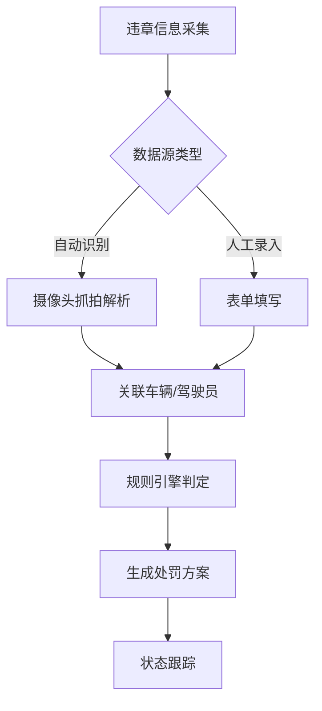
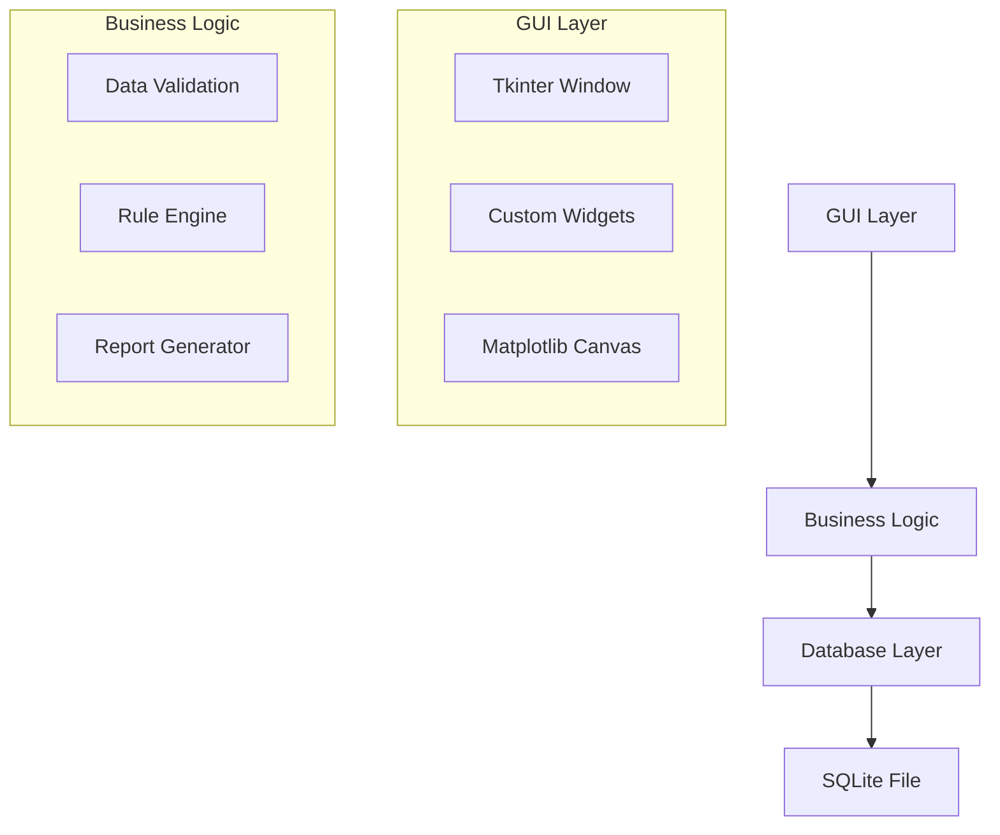

# 公路交通管理系统完整设计方案

---

## **一、系统概述**
**系统名称**：SmartRoad 交通综合管理平台  
**定位**：基于桌面端的公路交通数据一体化管理解决方案  
**核心目标**：实现"人-车-路-设备"四要素的数字化管理  
**技术栈**：Python + Tkinter + SQLite + Matplotlib  

---

## **二、数据库设计**

### **1. 核心数据表（5个主体）**

| 表名               | 字段说明                                                                                | 约束条件                                      |
|--------------------|---------------------------------------------------------------------------------------|---------------------------------------------|
| **vehicles**       | vehicle_id(PK), license_plate(UNIQUE), vehicle_type, owner, registration_date          | 车牌唯一，类型枚举（客车/货车/特种车辆/其他）           |
| **drivers**        | driver_id(PK), name, license_number(UNIQUE), contact_phone, valid_until, current_score | 驾驶证唯一，current_score默认12分               |
| **roads**          | road_id(PK), road_name, start_point, end_point, speed_limit, status                    | 状态枚举（畅通/拥堵/施工/关闭）                    |
| **violations**     | violation_id(PK), vehicle_id(FK), driver_id(FK), violation_time, location, violation_type, status | 外键关联车辆和驾驶员，状态枚举（未处理/已处理/申诉中） |
| **traffic_devices**| device_id(PK), device_type, location, installation_date, status                       | 类型枚举（摄像头/信号灯/测速仪/电子牌）               |

### **2. 扩展表（2个辅助）**
```sql
-- 设备维护记录表
CREATE TABLE maintenance_records (
    record_id INTEGER PRIMARY KEY,
    device_id INTEGER REFERENCES traffic_devices(device_id),
    maintenance_date DATE,
    operation_type TEXT CHECK(operation_type IN ('日常维护','故障维修','零件更换')),
    cost REAL
);

-- 系统操作日志表
CREATE TABLE operation_logs (
    log_id INTEGER PRIMARY KEY,
    user_id TEXT,
    operation_time DATETIME DEFAULT CURRENT_TIMESTAMP,
    action_type TEXT,
    detail TEXT
);
```

---

## **三、功能模块设计**

### **1. 基础数据管理**
| 子模块       | 核心功能                                                                               | 关键操作                                 |
|------------|--------------------------------------------------------------------------------------|----------------------------------------|
| **车辆管理** | - 车辆信息CRUD<br>- 批量导入/导出<br>- 年检到期提醒                                     | 车牌自动识别校验，支持扫描枪输入                      |
| **驾驶员管理**| - 驾驶证状态跟踪<br>- 扣分历史查询<br>- 证件到期预警                                   | 自动计算剩余分数，生成信用报告                      |
| **道路管理** | - 道路拓扑可视化<br>- 限速规则设置<br>- 状态实时更新                                   | 支持GPS坐标导入，拥堵阈值设置                     |
| **设备管理** | - 设备生命周期跟踪<br>- 维护记录管理<br>- 故障率统计                                   | 二维码设备标签支持，维护成本分析                    |

### **2. 违章处理中心**
**业务流程**：


**特色功能**：
- 多条件复合查询（时间范围+地点+车型）
- 电子证据链管理（图片/视频附件）
- 自动生成法律文书模板

### **3. 实时监控看板**
**数据可视化**：
- **道路状态热力图**：基于OpenStreetMap的简易GIS展示
- **设备运行状态**：
  ```plaintext
  █ 摄像头(85%) █ 信号灯(92%) █ 测速仪(78%) 
  [正常率= (正常设备数/总数)×100%]
  ```
- **实时报警窗口**：滚动显示最新异常事件（弹窗+声音提示）

### **4. 智能分析报表**
**报表类型**：
| 分析维度       | 输出形式                            | 示例指标                                     |
|--------------|-----------------------------------|--------------------------------------------|
| 违章分析       | 三维柱状图                         | 各路段违章类型分布TOP5                        |
| 流量预测       | 时间序列折线图                      | 未来2小时拥堵概率预测                         |
| 设备效能       | 雷达图                            | 摄像头故障率 vs 维护响应时间                   |
| 驾驶员行为     | 散点图                            | 驾龄 vs 违章次数的相关性分析                   |

---

## **四、GUI界面设计**

### **1. 主界面布局**
```plaintext
+-----------------------------------------+
|  Header 系统名称 | 用户信息 | 时间        |
+-----------------------------------------+
| 左侧导航菜单                            | 
|   - 数据管理 ▶                          |
|     • 车辆管理                          |
|     • 驾驶员管理                        |
|     • 道路管理                          |
|   - 违章处理                            |
|   - 实时监控                            |
|   - 统计分析                            |
|   - 系统设置                            |
+-----------------+-----------------------+
| 主工作区                                 |
|  [数据表格区]                           |
|  [详细信息表单]                          |
|  [操作按钮组]                           |
+-----------------------------------------+
| 状态栏 数据库状态 | 记录数统计 | 版本信息  |
+-----------------------------------------+
```

### **2. 关键交互组件**
| 组件类型       | 应用场景                                  | 实现方式                              |
|--------------|-----------------------------------------|-------------------------------------|
| **Treeview** | 数据列表展示                              | 支持多列排序、右键上下文菜单               |
| **Notebook** | 多标签页管理                              | 每个功能模块独立标签页                   |
| **Canvas**   | 道路网络绘制                              | 动态渲染交通流动画                      |
| **Combobox** | 枚举值选择                                | 联动加载（如选择路段后加载相关设备）         |

### **3. 典型操作流程**
**场景：处理超速违章**
1. 在违章模块点击"新增"按钮
2. 输入车牌自动带出车辆信息
3. 选择关联驾驶员（自动显示当前剩余分数）
4. 填写违章详情（自动定位最近测速设备）
5. 系统计算扣分并生成处罚编号
6. 打印处罚通知书（带二维码验证）

---

## **五、技术架构**

### **1. 分层架构**


### **2. 关键技术**
- **数据库优化**：
  - 建立复合索引（如`violations(violation_time, location)`）
  - 使用连接池管理数据库连接
- **异步处理**：
  - 大数据导出时启动后台线程
  - 使用`after()`方法实现界面无卡顿更新
- **数据安全**：
  - 敏感字段AES加密
  - 自动备份机制（每日增量备份）

---

## **六、扩展性设计**

### **1. 插件体系**
| 插件类型       | 功能扩展点                          | 实现方式                          |
|--------------|-----------------------------------|---------------------------------|
| 数据导入插件    | 支持Excel/CSV/JSON格式转换          | 实现统一接口规范                    |
| 分析算法插件    | 集成第三方预测模型                   | 使用Python的插件加载机制             |
| 硬件驱动插件    | 兼容不同品牌交通设备                  | 抽象设备通信协议                    |

### **2. 自动化任务**
| 任务类型       | 触发条件                  | 执行动作                          |
|--------------|-------------------------|---------------------------------|
| 每日数据归档    | 每日23:00               | 将历史数据迁移到归档数据库              |
| 驾照状态检查    | 每次启动时               | 自动吊销过期/0分驾照                 |
| 周报自动生成    | 每周一8:00              | 生成PDF报告并邮件发送                 |

---

## **七、系统特点**
1. **数据驱动**：所有操作基于数据库实时交互
2. **规则可配**：通过配置表管理扣分规则、预警阈值
3. **操作留痕**：完整记录每次数据变更（通过触发器记录操作日志）
4. **智能预警**：当出现以下情况时触发警报：
   - 同一路段连续3次超速违章
   - 关键设备离线超过1小时
   - 驾驶员分数低于3分

---

## **八、扩展方向**
1. **移动端集成**：通过PyQt Mobility扩展手机端功能
2. **AI增强**：
   - 基于OpenCV的车牌识别强化
   - 使用LSTM预测交通流量
3. **云端同步**：增加SQLite到MySQL的同步机制
4. **大屏展示**：开发专门的指挥中心可视化界面

---

本设计方案通过严谨的数据库结构设计、模块化的功能划分和人性化的GUI界面，实现了公路交通管理要素的全覆盖，既满足日常业务处理需求，又为决策分析提供数据支撑。系统预留的扩展接口和插件机制，可适应未来业务发展的需要。