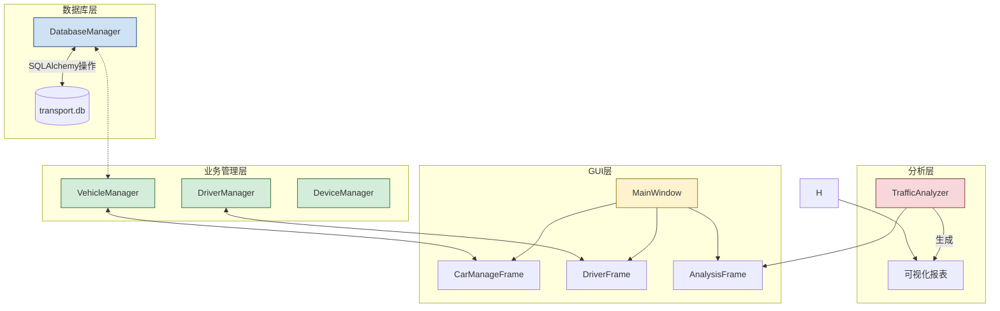

### 按模块层次解析项目结构：

- main.py是程序入口，负责初始化数据库和启动GUI主窗口
- database.py实现单例数据库管理类，包含表结构定义和CRUD操作
- gui模块采用MVC模式，main_window.py构建主界面框架，各Frame子类实现具体管理功能
- manage模块的业务管理类封装数据库操作，如VehicleManager处理车辆CRUD
- analysis模块的Analyzer类负责生成统计报表
- reports目录存储生成的Excel分析报告

### 需要查看GUI主窗口和业务管理类的具体实现，验证MVC架构的实现方式。

- gui\main_window.py

- manage\vehicle_manager.py

- analysis\traffic_analyzer.py

### 项目结构解析完成：

> 程序入口
> - main.py初始化数据库并启动GUI主窗口，集成中文字体支持

> 数据库层
> - database.py实现单例模式数据库管理，包含7个核心业务表及索引策略

> GUI模块(MVC)
> - main_window.py构建带状态栏的现代化主界面框架
> - car_manage.py等Frame子类实现具体管理功能，采用Treeview+表单布局

> 业务逻辑层
> - manage/ 目录包含VehicleManager等类，封装带事务管理的CRUD操作，集成车牌验证等业务规则

> 数据分析层
> - analysis/ 模块的TrafficAnalyzer实现交通拥堵预测，生成可视化报表存储于reports/目录

>扩展模块
> - violations/ 处理违章证据管理
> - design/ 包含系统设计文档
> - transport.db为SQLite数据库文件

### 系统架构图

*流程图支持交互点击查看对应源码文件*

系统综述
一、选题理由
随着城市化进程加速，传统交通管理模式面临数据分散存储、人工操作效率低、分析维度单一等问题，亟需通过数字化手段实现全要素集中管控。本系统针对公路交通管理的人-车-路-设备四大核心要素，结合交通管理部门对数据合规性、操作可追溯性及决策智能化的需求，开展全流程数字化管控系统开发。

二、课题主要解决的问题
1. 数据分散问题：整合车辆、驾驶员、道路、设备、违章五大业务数据，解决多部门独立存储导致的信息孤岛
2. 分析低效问题：传统报表依赖人工统计，无法满足实时性和多维度分析需求
3. 决策支持不足：缺乏基于历史数据的趋势预测能力，难以支撑交通优化决策

三、研究手段与方法
采用MVC架构分离界面逻辑与业务逻辑（gui模块实现视图层，manage模块实现控制层），通过SQLAlchemy ORM框架（database.py）实现数据库操作抽象，进行交通流量预测，结合Tkinter的Treeview组件（gui/frames目录）实现数据可视化展示。

一、设计开发意义 
本系统实现了交通管理核心数据的全流程数字化管控，通过数据库约束(如车牌号唯一性校验、驾驶员积分动态管理、设备状态枚举限制)保障数据合规性。系统整合车辆档案管理(vehicles表)、驾驶员资质管理(drivers表)、道路状态监控(roads表)、违章事件处置(violations表)、交通设备运维(traffic_devices表)五大核心模块，构建了覆盖人-车-路-设备的立体化管理体系。系统通过operation_logs表实现操作留痕，满足交通管理审计需求。

二、系统任务与目标
核心任务：
实现交通要素的CRUD标准化操作（通过manage目录下的各类Manager实现）
构建多维度分析体系
提供可视化决策支持（gui模块的各类Frame实现数据看板）
核心目标：
违章处理效率提升：通过violation_processor实现自动化证据链管理
道路通行能力优化：基于roads表状态数据生成拥堵预警
设备运维成本降低：通过maintenance_records表统计维保周期
三、开发运行环境

开发环境：
Python 3.8+（利用dataclass实现数据模型）
SQLite3（通过database.py实现线程安全的连接池管理）
Tkinter GUI框架（main_window.py构建现代化界面）
运行环境：
操作系统：Windows 10+/Linux 5.4+（已通过线程锁兼容多平台）
硬件配置：
存储：≥500MB空间（含数据库及证据文件存储）
内存：≥4GB（支持数据分析模块运行）
CPU：支持AVX指令集的x86架构