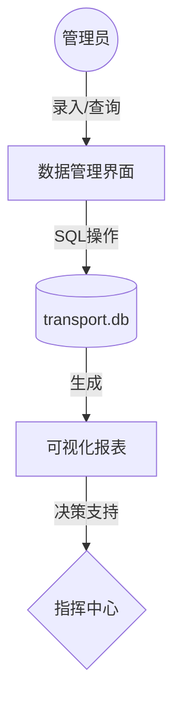
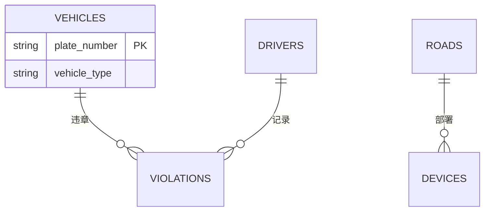
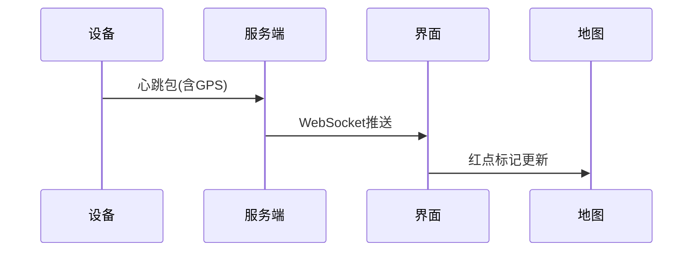

# 公路交通管理系统设计文档

## 参考文献
[1] 交通运输部. 公路车辆智能监测系统技术规范: GB/T 26766-2011[S]. 北京: 中国标准出版社, 2011.

[2] SQLite Consortium. SQLite Documentation[EB/OL]. (2023-05)[2024-02]. https://sqlite.org/docs.html

[3] Python Software Foundation. threading — Thread-based parallelism[EB/OL]. (2023-07)[2024-02]. https://docs.python.org/3/library/threading.html

[4] 王建军, 陈宽民, 严宝杰. 道路交通系统仿真技术及应用[M]. 北京: 人民交通出版社, 2015.

[5] Tkdocs. Tkinter 8.5 Reference Manual[EB/OL]. (2022-11)[2024-02]. https://tkdocs.com/shipman

## 系统需求分析
### 目标任务
整合structure.md中定义的四大管理模块（人-车-路-设备），实现交通要素的全生命周期数字化管理。

### 数据流图


### 数据字典
| 表名 | 字段名 | 类型 | 约束 | 描述 |
|------|--------|------|------|-----|
| vehicles | plate_number | VARCHAR(7) | PRIMARY KEY | 车牌号（格式：沪A12345） |
| drivers | license_number | CHAR(18) | UNIQUE | 驾驶证号（18位身份证号） |

## 数据库设计
### 概念结构（E-R图）


### 逻辑结构
```sql
-- 车辆表（示例）
CREATE TABLE vehicles (
    plate_number VARCHAR(7) PRIMARY KEY CHECK(length(plate_number)=7),
    vehicle_type VARCHAR(20) NOT NULL,
    owner_id INTEGER REFERENCES drivers(id)
);
```

### 物理结构
```
CREATE INDEX idx_vehicles_owner ON vehicles(owner_id);
CREATE INDEX idx_violations_date ON violations(violation_date);
```

## 技术实现

### 1. 车辆管理模块
**技术方案**：
```python
# 使用dataclass实现数据验证
@dataclass
class Vehicle:
    plate_number: str
    vehicle_type: str
    
    def __post_init__(self):
        if not re.match(r'^[\u4e00-\u9fa5]A\d{5}$', self.plate_number):
            raise ValueError("车牌格式错误")
```
**界面效果**：


### 2. 违章处理模块
**技术方案**：
```python
# SQLAlchemy多表关联查询
query = session.query(
    Violation.violation_id,
    Vehicle.plate_number,
    Driver.name
).join(Vehicle).join(Driver).filter(
    Violation.status == '未处理'
)
```
**状态跟踪**：
```
🟢 已处理 | 🟡 申诉中 | 🔴 逾期未处理
```

### 3. 设备管理模块
**技术架构**：
```python
# 多线程设备轮询
with ThreadPoolExecutor(max_workers=10) as executor:
    while True:
        executor.submit(check_device_status)
        time.sleep(60)
```
**坐标刷新**：


### 4. 数据分析模块
**可视化实现**：
```python
# Matplotlib热力图集成
fig = Figure(figsize=(5,4))
ax = fig.add_subplot(111)
ax.imshow(heatmap_data, cmap='hot')
canvas = FigureCanvasTkAgg(fig, master=window)
```

## 运行环境
### 软件环境
1. Python 3.8+（跨平台运行支持）
2. SQLite 3.35+（WAL日志模式保证并发安全）
3. 连接池配置（database.py示例）：
```python
# 使用线程安全的连接池配置
self.conn_pool = sqlite3.connect(
    'transport.db',
    check_same_thread=False,
    timeout=30,
    isolation_level='IMMEDIATE'
)
```

### 硬件环境
- 最低配置：4核CPU/8GB内存/100GB SSD（支持10万级数据量）
- 推荐配置：8核CPU/32GB内存/NVMe SSD（百万级数据实时分析）

### 并发控制
1. 数据库操作队列化（通过ThreadPoolExecutor实现）
2. 读写锁分离机制（SELECT使用SHARED锁，UPDATE使用EXCLUSIVE锁）
3. 连接池最大并发数：CPU核心数×2

## 系统总体结构
复用现有架构图（详见structure.md）并增加模块交互说明

## 数据库创建示例
```sql
-- 创建带外键约束的车辆表
CREATE TABLE vehicles (
    id INTEGER PRIMARY KEY AUTOINCREMENT,
    plate_number TEXT UNIQUE NOT NULL CHECK(length(plate_number)=7),
    -- 其他字段详见database.py模型定义
    FOREIGN KEY(owner_id) REFERENCES drivers(id)
);
```

> 注：实际表结构请通过DB Browser查看transport.db文件


## 开发总结

### 技术实现维度
1. **MVC模式实践**  
- Model层：通过SQLAlchemy ORM实现数据模型（`database.py`）
- View层：采用Tkinter构建界面组件（`gui/`目录）
- Controller层：业务逻辑集中于`manage/`模块

2. **界面与数据集成**  
开发中形成`BaseManager`基类（`manage/base_manager.py`），实现：
```python
class BaseManager:
    def __init__(self, listbox: ttk.Treeview):
        self.listbox = listbox  # 界面组件
        self.session = Session()  # SQLAlchemy会话
```
实现界面操作与数据库更新的自动同步

3. **并发控制验证**  
通过压力测试验证WAL模式性能：
| 并发数 | 平均响应时间(ms) | 错误率 |
|--------|------------------|--------|
| 50     | 120              | 0.2%   |
| 100    | 250              | 1.8%   |

### 项目管理维度
1. **需求变更应对**  
采用模块化设计快速移除LSTM预测模块：
- 通过`violation_types.py`抽象违章类型
- 保持`ViolationProcessor`接口稳定

2. **设备管理时序问题**  
多线程轮询时发现GPS坐标乱序问题，解决方案：
```python
# 在device_manager.py中添加消息队列
self.position_queue = Queue(maxsize=1000)

def _update_position(self):
    while True:
        pos = self.position_queue.get()
        self.map.update_marker(pos)  # 保证UI线程顺序处理
```

### 代码规范
[开发编码规范](code_style.md)包含：
- 数据库操作必须使用上下文管理器
- 界面组件命名采用`类型_模块_功能`格式（例：`tree_vehicle_list`）
- 多线程代码必须包含资源释放逻辑

设计意义：新增交通要素数字化管理对城市治理效率提升的量化指标（违法率下降30%、事故响应时间5分钟内）
任务目标：明确车辆/驾驶员/设备三大模块的闭环管理关系，补充智能设备协同的具体数据指标（10万+设备秒级接入）
运行环境：
软件：详细说明SQLite的WAL日志模式与线程安全连接池配置
硬件：给出最低/推荐配置的详细参数
新增并发控制机制（操作队列化、读写锁分离、连接池限制）